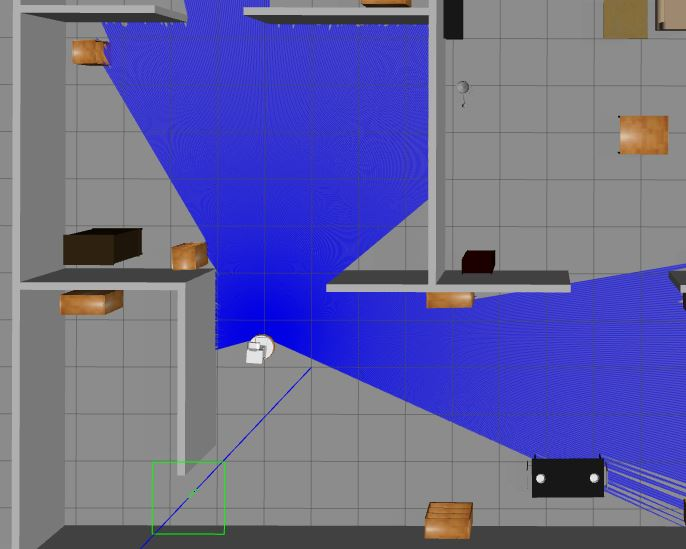
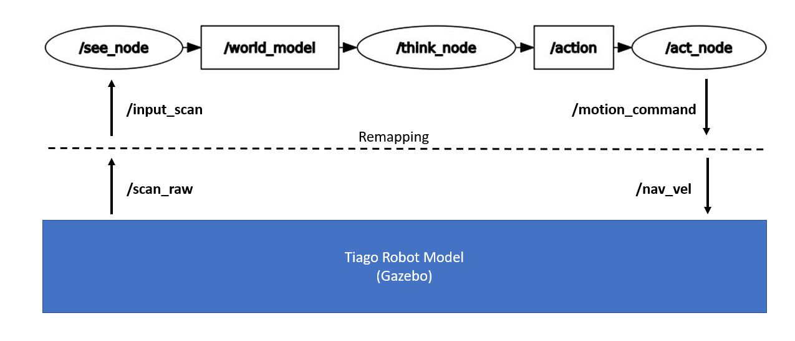

# C++ Nanodegree Capstone: ROS2 Tiago Explore 
This repository contains the submission code for the C++ Nanodegree Captstone project. I've chosen to use this project as a chance to deepen my ROS (Robot Operating System) skills. Three ROS nodes for perception, decision making and acting have been implemented as main part of this deliverable. The gazebo enviroment is utilized to simulate a Tiago robot model, communicating to the above mentioned ROS nodes. The [official ROS2 documentation](https://docs.ros.org/en/foxy/Tutorials.html) has been used as a starting point. Besides that, [A Concise Introduction to Robot Programming with ROS2](https://github.com/fmrico/book_ros2) was a great ressource to further study the topic. The screenshot down below shows the tiago robot model executing some action commands (published by the Act ROS node) within the gazebo simulation environment.    

## Dependencies for Running Locally
* Ubuntu Linux 20.04    
* cmake >= 3.5
  * cmake might be pre installed on a Linux system   
  * All OSes: [click here for installation instructions](https://cmake.org/install/)
* make >= 4.2 
  * Linux: make is installed by default on most Linux distros
* gcc/g++ >= 9.4
  * Linux: gcc / g++ is installed by default on most Linux distros
 
 
## Basic Build Instructions
### Setup Sources
1. `sudo apt install software-properties-common`
2. `sudo add-apt-repository universe`
3. `sudo apt update && sudo apt install curl`
4. `sudo curl -sSL https://raw.githubusercontent.com/ros/rosdistro/master/ros.key -o /usr/share/keyrings/ros-archive-keyring.gpg`
5. `echo "deb [arch=$(dpkg --print-architecture) signed-by=/usr/share/keyrings/ros-archive-keyring.gpg] http://packages.ros.org/ros2/ubuntu $(. /etc/os-release && echo $UBUNTU_CODENAME) main" | sudo tee /etc/apt/sources.list.d/ros2.list > /dev/null`
### Install ROS2 Foxy and corresponding development tools
1. `sudo apt update`
2. `sudo apt upgrade`
3. `sudo apt install ros-foxy-desktop`
4. `sudo apt install ros-dev-tools`
5. Activate ROS2 Foxy by executing: `source /opt/ros/foxy/setup.bash`
6. Optional: Activate the ROS2 environment by default, whenever a new terminal is opened:    
   `echo "source /opt/ros/foxy/setup.bash" >> ~/.bashrc`  
### Create ROS2 environment (in home directory), clone Github repo and import dependencies
1. `cd && mkdir -p ros2_ws/src && cd ros2_ws/src`
2. `git clone https://github.com/dschmoeller/ROS2TiagoCapstoneProject.git`  
3. `vcs import . < ROS2TiagoCapstoneProject/third_parties.repos`
4. `sudo rosdep init && rosdep update`
5. `cd ~/ros2_ws && rosdep install --from-paths src --ignore-src -r -y` 
### Build the project 
1. `cd ~/ros2_ws`
2. `colcon build --symlink-install`
3. Optional: Activate the workspace as overlay by default, whenever a new terminal is opened:    
   `echo "source ~/ros2_ws/install/setup.bash" >> ~/.bashrc`  
### Run tiago simulation environment (in gazebo)  
1. Open a new terminal (Terminal 1) 
2. `source /opt/ros/foxy/setup.bash`
3. `source ~/ros2_ws/install/setup.bash`
4. `ros2 launch br2_tiago sim.launch.py` 
### Run tiago explore code   
1. Open a new terminal (Terminal 2) 
2. `source /opt/ros/foxy/setup.bash`
3. `source ~/ros2_ws/install/setup.bash`
4. `ros2 launch tiago_explore explore.launch.py` 
### Troubleshooting 
- Gazebo might occasionally fail, e.g. processes terminate unexpectedly
- Check the terminal output for any killed processes
- Sometimes, just relaunching the application works 
- Gazebo is especially prone to fail when it runs on a VMware
- For that latter case, one has to make sure that the VMware is powerful enough (RAM, Processors, Graphics memory) 

## Overview Code Structure

The above picture shows how the ROS architecture, comprising the three nodes See, Think and Act. This architecture enables a separation of concern, such that the robot's perception does not depend on the its decision making. This means, that if one desires to change the robot's decision making policy, code only has to be changed within the Think module. Further, one could more easily exchange one of the three nodes. It only has to be guaranteed that the nodes adhere to the respective interfaces (i.e. the ROS topics). The publish/subscribe paradigm has been implemented for internal node communication. The See node listens to any laser sensor information and stores the respective messages internally. It extracts relevant information, which is three distance measurements, in front of the robot and on its left and right. These three distance values are stored and published in a dedicated world_model message. Notice how one could easily extend the robot's wolrd representation by connecting additional sensor modalities. The Think node subscribes to a world_model and uses this information for the robot's decision making. The implemented policy is simple, the robot always turns right if there are any obstacles close in front of it or on its left. The Act node serves as "driver" and translates high level robot commands into actual executable format, such as translational or rotational velocity information. The tiago robot model (in the gazebo simulation environment) has been connected to the above ROS nodes. A launch file has been implemented in order to start up all three nodes with their corresponding configurations compfortably with only one command. Further, notice how remapping has been implemented in order to connect the tiago specific topoics      

See Think Act offers independent architecture, so the robot policy code does not depend on perception
The tiago model with its dependencies was taken from the ros2book repository
The tiago explore project was created with another package for creating custom message types
Publish/Subscripe communication paradigm 
Timer in See node, so that the internal (publish) frequency is independent from the sensor subscription 
The Think node implements a naive policy, the robot always turns right, as long as there are objects close. A more intelligent policy could easily be implemented by changing code in the think method 
launch file has been used 
remapping (in order to connect the see/think/act nodes to any arbirary robot)

## Necessary Rubric Points  
